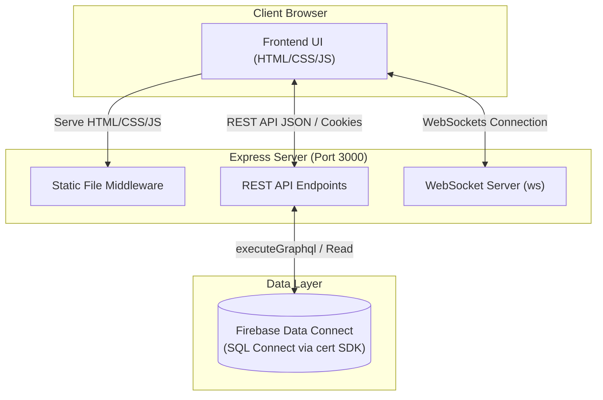
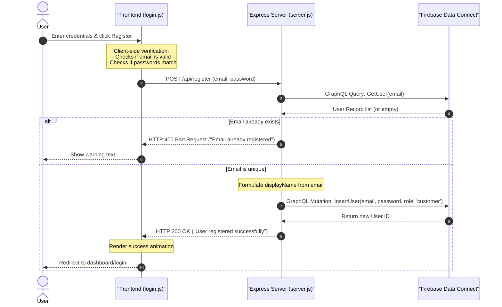

# System Architecture

This document describes the technical architecture of the ALDI E-Commerce System, covering the client-side frontend, Node.js Express server backend, real-time WebSocket messaging, and the Firebase Data Connect database layer.

---

## 1. System Overview

The system uses a unified **Client-Server Architecture** where the Node.js backend serves the static frontend assets, exposes e-commerce REST API endpoints, runs a WebSocket server for real-time telemetry, and communicates with Firebase Data Connect.

---

## 2. Frontend Architecture

The frontend is served out of the [`/static`](file:///e:/projects/antigravity/aldi-ecommerce-system/static) directory. It operates as a multipage application without runtime javascript framework overhead:

* **Entry and Flow Pages**:
  - `index.html`: Store landing page.
  - `products.html` & `product-detail.html`: Product browsing and detail specifications.
  - `login.html`: Unified registration and authentication forms.
  - `checkout.html` & `order-confirmation.html`: Cart purchase summary and success receipt.
  - `admin.html`: Staff panel protected by role-based auth.
* **Styles (`css/style.css`)**: Vanilla CSS defining a cohesive design system using HSL color variables matched to ALDI's official branding (dark background, primary navy, secondary orange, light blue, and yellow accents). Features premium glassmorphic cards (`backdrop-filter`), flex layouts, and smooth transition animations.
* **Logic (`js/main.js` and `js/login.js`)**: 
  - Manages shopping cart state inside the browser's `localStorage`.
  - Automatically fetches and updates product information from the backend API.
  - Handles token authentication state.

---

## 3. Backend & Authentication Architecture

The backend is built on **Node.js** and **Express** ([`backend/server.js`](file:///e:/projects/antigravity/aldi-ecommerce-system/backend/server.js)), combining static file serving, cookie-based session management, WebSocket broadcasting, and GraphQL communication.

### JWT Cookie Authentication
1. Upon successful login, the server generates a JSON Web Token (JWT) containing the user's ID, email, name, and role.
2. The server sets this token as an **HttpOnly, SameSite=Lax** cookie named `aldi_jwt` in the client's browser, preventing cross-site scripting (XSS) extraction.
3. API endpoints can also accept the JWT token via:
   - The `Authorization: Bearer <token>` header.
   - The `x-auth-token` header.
   - A `token` query parameter.

### Role-Based Access Control (RBAC)
* Access to `admin.html` and any routes under `/api/admin/*` is restricted by a custom middleware (`adminProtect`).
* The middleware verifies the JWT and ensures the user's role is one of: `admin`, `financial_officer`, or `employee`.
* If a customer attempts to access `admin.html`, they are shown a custom `403 Forbidden` response. If they are not logged in, they are redirected to `login.html`.

### WebSocket Broadcasting
* The server instantiates a `ws` server on the same HTTP port.
* Authenticated staff users establishing a WebSocket connection with a valid token will receive real-time updates when orders are placed.
* For example, checkout completions trigger a `financial_update` payload containing transaction prices, ids, and timestamps.

---

## 4. Database Layer (Firebase Data Connect)

The system communicates with **Firebase Data Connect (SQL Connect)**, a modern managed SQL database. Rather than standard SQL queries, the application executes GraphQL queries and mutations through the Firebase Admin SDK (`backend/db.js`).

### Schema Definition Summary
* **`User`**: Account profiles, hashed passwords, roles (`customer`, `admin`, `employee`, `financial_officer`).
* **`Product`**: Item catalog details (name, category, price, stock quantity, image URL).
* **`Cart` & `CartItem`**: Active cart state mapping users to selected products and quantities.
* **`Order` & `OrderItem`**: Completed order records and line items locking prices at the moment of checkout.
* **`FinancialRecord`**: Ledger tracking transaction values and associations for financial audits.

---

## 5. End-to-End Registration Flow

Below is the sequence diagram of a registration request:

---

## 6. Checkout Flow & Atomic Transaction Rollback

When a customer checks out, the backend processes their order in multiple steps. To maintain financial and inventory integrity, the system implements a code-based transaction rollback:

1. **Insert Order**: Creates the master order record.
2. **Insert OrderItems**: Creates individual line items linking products and quantities to the order.
3. **Insert FinancialRecord**: Attempts to insert a matching transaction record.
4. **Rollback Trigger**: If the financial record insertion fails, a manual rollback is executed by deleting both the `OrderItems` and the `Order` records in sequence to prevent orphan records.

```mermaid
sequenceDiagram
    autonumber
    actor Customer as "Customer Client"
    participant BE as "Express Server (server.js)"
    participant DC as "Firebase Data Connect"
    participant Staff as "Admin WebSocket Client"

    Customer->>BE: POST /api/checkout (items, shippingInfo)
    Note over BE: Extract User ID from JWT Cookie
    BE->>DC: GraphQL Mutation: InsertOrder
    DC-->>BE: Order ID
    
    loop For each item in cart
        BE->>DC: GraphQL Mutation: InsertOrderItem(OrderID, ProductID, quantity)
        DC-->>BE: Item inserted
    end
    
    rect rgb(30, 40, 50)
        Note over BE, DC: Atomic Financial Ledger Check
        BE->>DC: GraphQL Mutation: InsertFinancialRecord(OrderID, transactionId)
        
        alt Financial Insertion Fails
            DC--xBE: Error (e.g. Unique Constraint Violation)
            Note over BE: Initiate Rollback Flow
            BE->>DC: GraphQL Mutation: DeleteOrderItems(OrderID)
            BE->>DC: GraphQL Mutation: DeleteOrder(OrderID)
            BE-->>Customer: HTTP 500 Internal Error ("Checkout failed, transaction rolled back")
        else Financial Insertion Succeeds
            DC-->>BE: Financial Record ID
            BE->>Staff: WebSocket Broadcast (financial_update)
            BE-->>Customer: HTTP 200 OK (success: true, orderId, transactionId)
        end
    end
```

