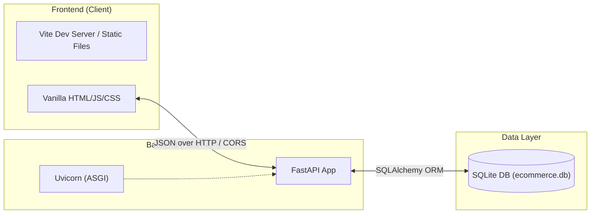
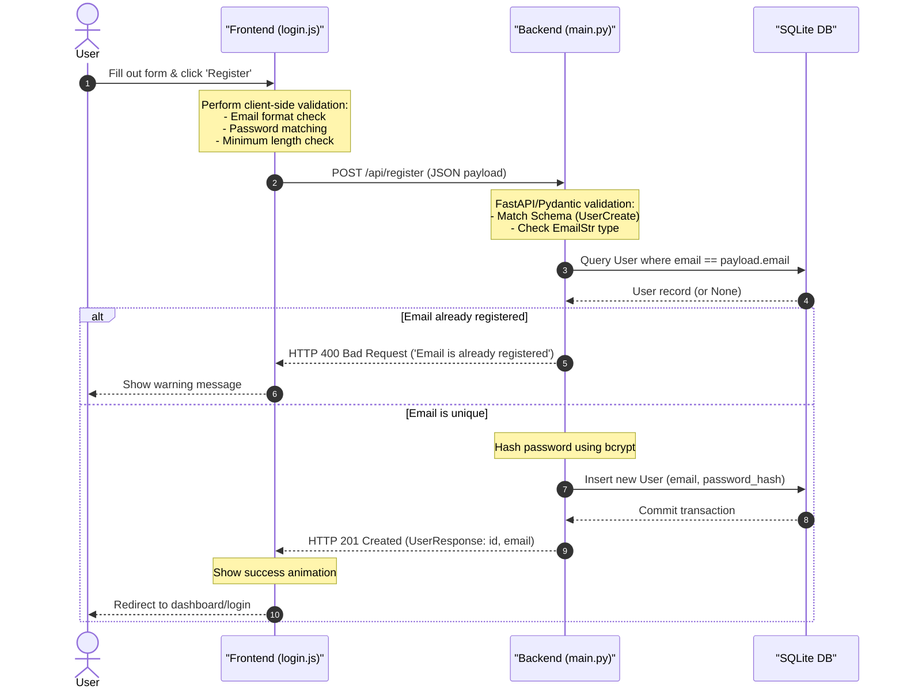

# System Architecture

This document describes the technical architecture of the ALDI E-Commerce System, covering both the frontend and backend components, as well as database schemas and request-response life cycles.

---

## 1. System Overview

The system uses a decoupled **Client-Server Architecture** consisting of a modern lightweight frontend and a performant Python-based backend.

---

## 2. Frontend Architecture

The frontend is located in the `/frontend` directory and is built using modern web development standards without heavy runtime frameworks:

* **Build Tool & Dev Server**: Powered by [Vite](https://vite.dev/) for fast module replacement and efficient bundling.
* **Component Structure**:
  * `index.html`: Entry point, performs client-side routing/redirect to `login.html`.
  * `login.html`: The user authentication center (includes the Registration form).
  * `src/style.css`: Contains CSS variable tokens mapping to official ALDI brand guidelines (navy, orange, light blue, yellow) and styles for custom Glassmorphism components.
  * `src/login.js`: Client-side validation and event handling for submitting registration payloads.
* **Aesthetics**: Premium Glassmorphism styling utilizing background blurs (`backdrop-filter`), vibrant overlays on the custom ALDI background, and modern typography (using the `Outfit` Google Font).

---

## 3. Backend Architecture

The backend is located in the `/backend` directory, implemented as a secure RESTful API built on **FastAPI**:

* **Server Framework**: [FastAPI](https://fastapi.tiangolo.com/) is used for its high performance, automatic interactive docs (Swagger/OpenAPI), and native support for asynchronous programming.
* **Validation & Schemas**: [Pydantic](https://docs.pydantic.dev/) handles incoming request payload parsing, strict type checking (e.g. `EmailStr`), and response serialization.
* **Security & Hashing**: Passwords are secure-hashed using `passlib` with the `bcrypt` algorithm before insertion into the database. Plain text passwords are never stored or logged.

---

## 4. Database Layer

* **Engine**: [SQLite](https://sqlite.org/) is used as a lightweight local database, mapping to `backend/ecommerce.db`.
* **ORM**: [SQLAlchemy](https://www.sqlalchemy.org/) handles database schema creation, session management, and object-relational mapping.

### Schema: `users`
| Column | Type | Constraints | Description |
| :--- | :--- | :--- | :--- |
| `id` | `INTEGER` | Primary Key, Autoincrement | Unique internal user identifier. |
| `email` | `VARCHAR` | Unique, Indexed, Not Null | Registered email address (used for login). |
| `password_hash` | `VARCHAR` | Not Null | Bcrypt hashed password. |

---

## 5. End-to-End Registration Flow

Below is the sequence diagram of a registration request:

